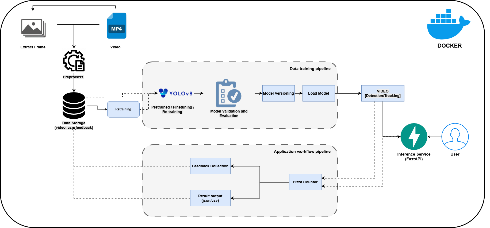

# 🍕 Pizza Detection & Counting System

## Overview

This project is an end-to-end system for detecting, tracking, and counting pizzas in CCTV-like videos. It features a FastAPI backend for processing and a Streamlit frontend for user interaction, all orchestrated with Docker Compose. The system enables object detection, multi-object tracking (SORT), region-based pizza counting, and user feedback submission for future improvements.

---

## 🎯 Target

**Objective:**  
Build a system to count the total number of pizzas sold over a given period using the provided CCTV videos. The system should:

- Detect pizzas from videos using a computer vision model.
- Track pizzas across frames to avoid duplicate counting.
- Count pizzas accurately using a defined counting region.
- Collect user feedback for future model improvement.
- Be deployable via Docker Compose.

Although the system is not required to include model retraining, it should be designed in a way that future improvement via feedback is possible.

---

## 📊 Pipeline Overview



The main components of the pipeline include:

- **YOLOv8** for real-time pizza and person detection.
- **DeepSORT (via sort-tracker-py)** for multi-object tracking.
- **Custom polygon regions** to trigger pizza counting logic.
- **FastAPI backend** for processing and feedback.
- **Streamlit frontend** for user interaction.
- **Docker Compose** for unified deployment.

---

## 🎬 Demo

[![Demo Video, download the video to watch, thank you!]](img_video_demo/pizza_countin_demo.mp4)
<video src="img_video_demo/pizza_countin_demo.mp4" controls width="600"></video>

---

## ⚙️ Requirements

- **Docker** and **Docker Compose** (recommended)
- Or: Python >= 3.12 and pip (for manual/local run)

---

## 🛠 Installation & Usage

### 1. Clone the repository

```bash
git clone <your-repo-url>
cd MLops_Pizza-Detection
```

### 2. Build and run with Docker Compose

```bash
cd docker
docker-compose up --build
```

- **Backend (FastAPI):** http://localhost:8000  
- **Frontend (Streamlit):** http://localhost:8501

### 3. Manual run (optional)

```bash
pip install -r requirements.txt

# In terminal 1
uvicorn src.api.app:app --host 0.0.0.0 --port 8000

# In terminal 2
streamlit run src/streamlit/client.py --server.port=8501
```

---

## How to Use

1. Open [http://localhost:8501](http://localhost:8501)
2. Upload or choose a video to process
3. Click **Start Live Detection** to begin detection & tracking
4. Click **Stop Processing** to end session and download the results (CSV, video)
5. Submit optional feedback to improve future versions

---

## 🧱 Project Structure

```bash
src/
├── api/         # FastAPI backend logic and API endpoints
├── data/        # Uploaded videos, processed results, feedback
├── detection/   # YOLOv8 detection, SORT tracking, counting logic
├── streamlit/   # Streamlit UI for video processing & feedback
├── model/       # Placeholder: model training/fine-tuning (planned)
├── retraining/  # Placeholder: feedback-based retraining logic (planned)
docker/          # Docker setup and orchestration files
img_video_demo/  # Pipeline images and demo media
data             # Video cut for demo, feedback folder. Raw video and frames folder (I delete it because it's to big, take time to push on github)
requirements.txt
```

> ⚠️ The `model/` and `retraining/` directories are currently placeholders.  
> Retraining functionality was part of the intended plan but not implemented due to time constraints.

---

## 📡 API Endpoints Summary

- `POST /process` — Start processing a video
- `GET /stream/{video_name}` — Live stream of processed video
- `POST /stop/{video_id}` — Stop processing
- `GET /results/{video_id}` — Get counting results (CSV)
- `GET /video/{video_id}` — Download final processed video

---

## 💬 Feedback Collection & Retraining

After viewing a processed video, users can submit structured feedback from the frontend.  
This feedback is saved in `.json` format and will be useful for future model refinement or retraining.

---

## 🐳 Docker-Orchestrated Pipeline

- FastAPI and Streamlit run in **separate containers**
- Both services share data using **Docker volumes**
- Easy-to-use, portable MLOps pipeline for video analytics

---

## Conclusion

The final system successfully:

- Detects pizzas using **YOLOv8**.
- Tracks them using **DeepSORT**.
- Counts them based on movement through custom **polygon regions**.
- Displays results and allows feedback via a web interface.

Although the system occasionally miscounts pizzas due to detection errors or camera angles, it meets the core goal of the project — automating the counting of pizzas sold using CCTV footage.

---

## 🙏 Acknowledgment

I would like to express my sincere gratitude to **EATLAB** for giving me the opportunity to complete this technical assignment.

---

## Personal Reflection

Through this challenge, I had the opportunity to combine my foundational knowledge of object detection with real-world coding experience. More importantly, I learned many new things during the implementation — from building an MLOps pipeline, integrating object tracking via DeepSORT, to solving practical issues in logic-based pizza counting.

This assignment encouraged me to be resourceful, to learn quickly, and to overcome problems one by one — from camera-frame mismatches, ID switching in tracking, to designing a modular architecture. Despite time limitations, I chose to include retraining and feedback components in the pipeline diagram to demonstrate a vision of continuous improvement.

This has been a valuable and rewarding experience for me. I enjoy learning through solving real problems and always seek the most effective solution — even when it means trying unfamiliar tools or approaches. I truly appreciate this opportunity.

This was also my first time building a project with an MLOps perspective. Although I have not yet implemented full retraining or fine-tuning from user feedback, I took the initiative to self-study the fundamentals of MLOps pipelines and reflect that understanding in the project structure — even if some parts remain incomplete.

Once again, I sincerely thank the company for providing such a real-world problem to work on. It was both challenging and inspiring, giving me the chance to grow through research, self-learning, implementation, and iteration.
---

## 📬 Contact

For any questions or feedback, please open an issue or contact me at:  
📧 [pnhatanh71@gmail.com]
